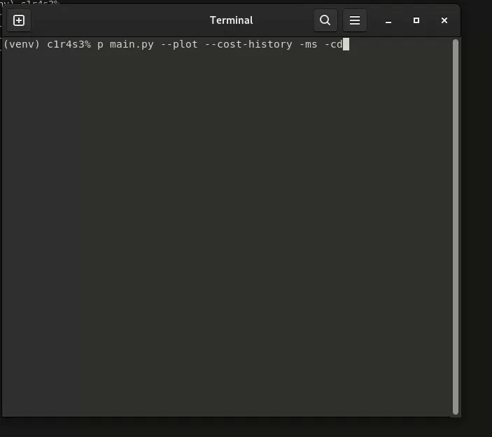

# ft_linear_regression

A simple linear regression algorithm implementation to predict car prices based on mileage.

## Overview

This project implements a basic machine learning algorithm: linear regression with gradient descent. It consists of two programs:

1. **Training program (`main.py`)**: Reads a dataset, performs linear regression using gradient descent, and saves the model parameters.
2. **Prediction program (`predict.py`)**: Uses the trained model to predict the price of a car for a given mileage.

## Demo



## Installation

### Setting up a Virtual Environment

It's recommended to use a virtual environment to avoid conflicts with other Python projects:

1. **Install virtualenv** (if not already installed):
   ```bash
   pip install virtualenv
   ```

2. **Create a virtual environment**:
   ```bash
   # Navigate to your project directory
   cd path/to/ft_linear_regression

   # Create the virtual environment
   python3 -m venv venv
   ```

3. **Activate the virtual environment**:
   - On Linux:
     ```bash
     source venv/bin/activate
     ```

4. **Install dependencies**:
   ```bash
   pip install -r requirements.txt
   ```

5. **Deactivate the virtual environment** when finished:
   ```bash
   deactivate
   ```

## How It Works

### Linear Regression Model

The algorithm uses a simple linear hypothesis function to predict car prices:

```
estimatePrice(mileage) = θ0 + (θ1 * mileage)
```

Where:

* θ0 is the y-intercept (base price)
* θ1 is the slope (price change per mileage unit)
Gradient Descent Algorithm
The training process uses gradient descent to optimize the parameters:
```
tmpθ0 = learningRate * (1/m) * Σ(estimatePrice(mileage[i]) - price[i])
tmpθ1 = learningRate * (1/m) * Σ(estimatePrice(mileage[i]) - price[i]) * mileage[i]
```

## Usage

### Training the Model (main.py)

```bash
python3 main.py [options]
```

#### Command-Line Options:

| Flag | Short Flag | Description |
|------|------------|-------------|
| `--cost-history` | `-ch` | Displays a plot showing how the cost (error) decreases during training iterations. This helps visualize the model's learning progress and confirm convergence. |
| `--coefficient-determination` | `-cd` | Calculates and displays the R² value, which indicates how well the model fits the data (1.0 = perfect fit, 0.0 = no fit). |
| `--plot` | `-p` | Enables visualization during training, showing how the regression line adjusts to fit the data points. Also displays the final regression plot. This is enabled by default. |
| `--save-pictures` | `-sp` | Saves the regression model plot and cost history chart as PNG files in the current directory ('regression_model.png' and 'cost_history.png'). |
| `--mean_squared_error` | `-ms` | Calculates and displays three error metrics: Mean Squared Error (MSE), Root Mean Squared Error (RMSE), and Mean Absolute Error (MAE). |

Examples:
```bash
# Basic training with default parameters
python3 main.py

# Train with visualization and save the plots
python3 main.py --plot --save-pictures

# Train and display all available metrics
python3 main.py --cost-history --coefficient-determination --mean_squared_error
```

The program expects a file named `data.csv` in the working directory with mileage and price columns.

### Predicting Prices

```bash
python3 predict.py [mileage]
```

If no mileage is provided, the program will prompt for input.

### Bonus Features

- **Data Normalization**: Enables handling data of any scale without adjusting learning rate
- **Learning Visualization**: Displays regression line movement during training
- **Final Plot**: Shows regression line with denormalized values
- **Cost History**: Tracks and displays model fit improvement over iterations
- **Coefficient of Determination (R²)**: Measures goodness of fit
- **Optional Visualization**: Enable/disable plots with command-line flags
- **Save Plots**: Export regression and cost history plots as image files
- **Additional Metrics**: MSE, RMSE, MAE for model evaluation

### Requirements

- Python3
- NumPy
- Matplotlib

### Files Description

- `main.py`: Training program with visualization and metrics
- `predict.py`: Prediction program that loads trained parameters
- `data.csv`: Dataset file (not included, must be provided)
- `results.csv`: Output file with trained parameters (generated after training)

### Algorithm Performance

The performance of the linear regression model can be evaluated using:

- **Mean Squared Error (MSE)**
- **Root Mean Squared Error (RMSE)**
- **Mean Absolute Error (MAE)**
- **Coefficient of Determination (R²)**

These metrics help assess how well the model fits the data and how accurate its predictions are.